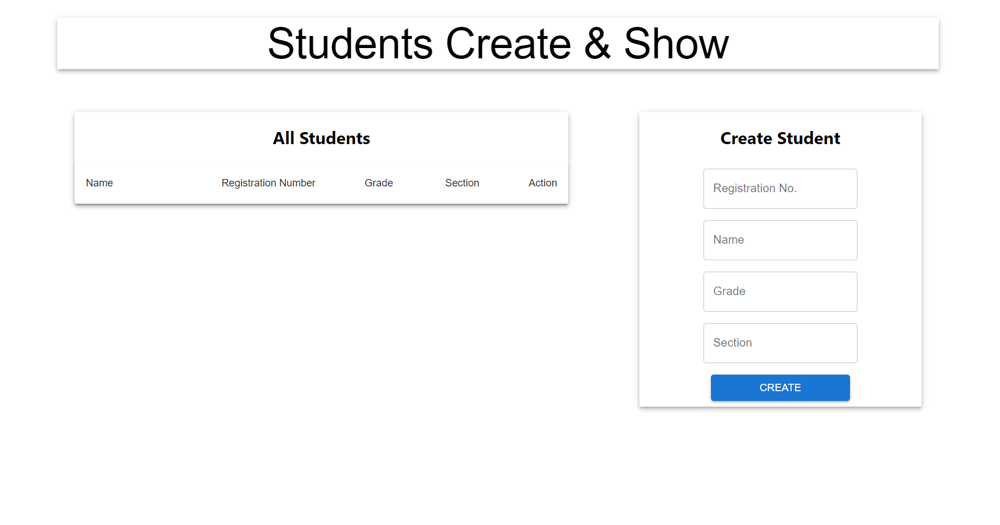
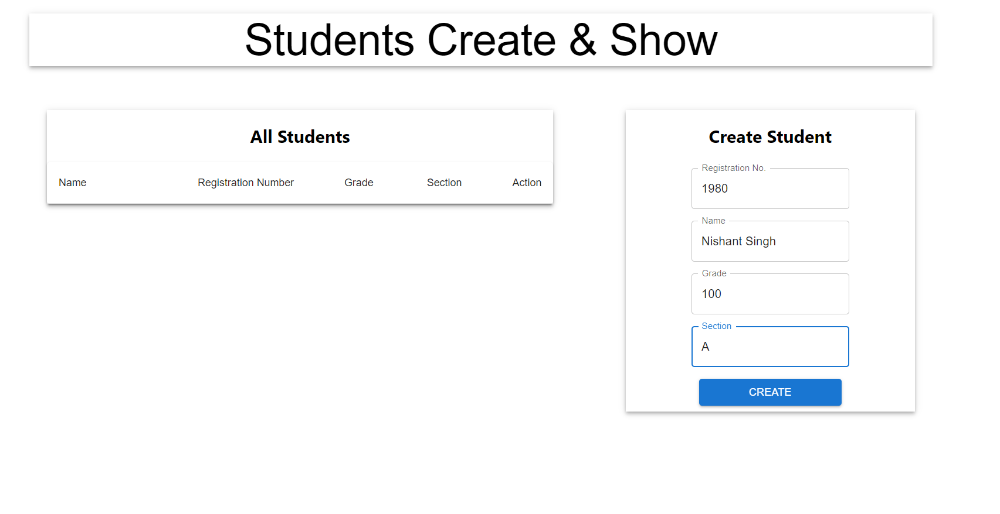
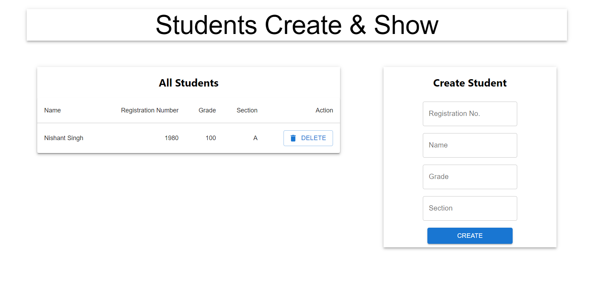

# Student create and show MERN Stack Application

This app will create students and delete their entries using MERN stack for any organisation.

Below is it's working.

## Project Working Results

### Main HomePage

### Fill Entries and Press Create

New Student has been successfully created.

### Delete Student Entry by pressing Delete button

Entry has been deleted.

